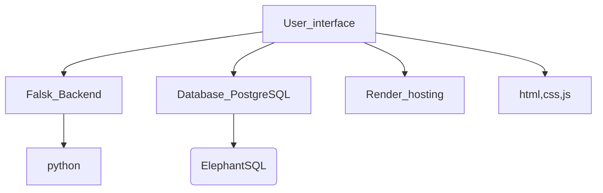

# Finance-planner

### Objective: 
The finance planner web application aims to help users effectively manage their personal finances by providing comprehensive and user-friendly tools for tracking their accounts, expenses, and investments. The application will allow users to set financial goals, track their progress towards these goals, and receive personalized recommendations for optimizing their spending and saving habits. Additionally, the application will provide users with a detailed overview of their monthly expenses, income, and savings, as well as a breakdown of their spending by category. Users will also be able to access educational resources and tools to improve their financial literacy and make more informed decisions about their finances. Overall, the finance planner web application seeks to provide users with the necessary tools and resources to achieve their financial goals and improve their financial wellbeing.

### Features of this application:
1. Account Updates: Users can Register and login with specific email id and passwords , can maintain session inside the finance_planner.
2. Budget Logs: Users can create and manage budgets for different categories of expenses, such as groceries, rent, entertinment and many more.
3. Expense Overview with Graphical Representation: Users can view a graphical representation of their monthly expenses to better understand where their money is going.
4. Goals: Users can set financial goals, such as saving for a down payment on a house or paying off debt, and track their progress towards these goals.
5 .Monthly Saving Graph Overview: Users can view a graphical representation of their monthly savings to monitor their progress towards their savings goals.
6. Category-wise Expenses Overview: Users can view a breakdown of their expenses by category, such as food, transportation, and entertainment.
7. Credit Details Logs: Users can track their credit score and view their credit card balances and payment histories.
8. Taxation: Users can estimate their tax liabilities based on their income and expenses, and receive personalized recommendations for optimizing their tax strategy.
9. Investments: Users can go through investments ideas, take adavntage of give other tools which helps in selecting suitable stocks and analysis of stocks, also inculde other investment details.
10 .Learnings: Users can access educational resources and tools to improve their financial literacy and make more informed decisions about their finances.

### NOTE:
These features have been designed with the aim of making the finance planner web application accessible and easy to use for people who are new to personal finance management. The features are intended to provide users with a comprehensive set of tools to help them manage their finances effectively, even if they have limited experience or knowledge in this area.

### Architecture:
1. Backend: The finance planner web application is built using Flask, a popular Python web framework. Flask provides a simple and flexible architecture for building web applications and APIs.
2. API Testing: The API can be tested using Insomnia, a powerful and easy-to-use API testing tool. Insomnia allows developers to test API endpoints and responses, as well as debug and analyze API requests.
3. Frontend: The frontend of the application is built using HTML, CSS, and JavaScript. These technologies are widely used for building web applications and provide a flexible and responsive user interface.
4. Database: The application uses PostgreSQL, a popular open-source relational database management system, for storing and managing data. The database is hosted on an instance of ElephantSQL, a cloud-based database service that provides scalable and reliable database hosting.

        

### Step by Step guide to run this file in local
 1.Clone the repo "git clone this repo ssh link"
 2.Run the setup.py
 3.move into finance_planner dir (cd finance_planner)
 4.source virtual env (source proj_venv/bin/activate)
 5.source build.sh
 6.Run this command (python3 -m app.app)
 7.one localhost link will poped up in terminal click on that link.

